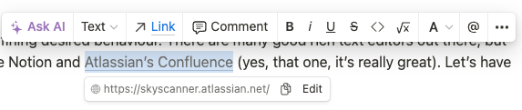
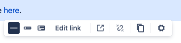
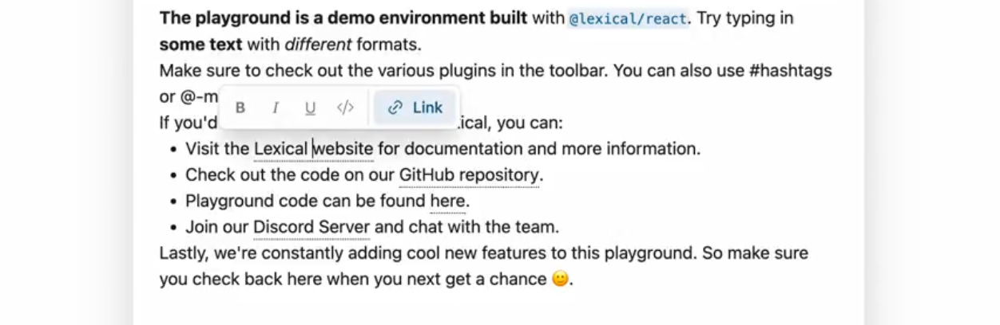
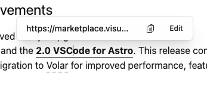
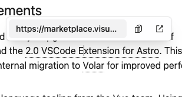
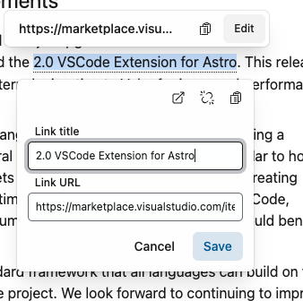

There are many good rich text editors out there, but the ones I like the most are [Notion](https://www.notion.so/) and [Atlassian’s Confluence](https://www.atlassian.com/software/confluence) (yes, that one, it’s really great). Let’s have a look at their toolbars.

**Notion:**

**Atlassian’s Confluence:**

Not exactly formatting toolbar, but AFAIK Confluence does not have floating toolbar option, only fixed one on the top.

The text formatting itself is pretty simple, the main complications are coming from links handling. So, taking inspiration:

- show floating toolbar only when mouse selection is over (Notion);
- support adding link to selected text (both);
- if selected text is a link, allow modifying the link AND the text. Useful when user wants to replace completely the text without loosing the link address;
- when modifying the link, select whole link to show what exactly is going to be modified; Useful when user didn’t select one character of the link and now wondering if that one character is going to have an old link or a new one (hello Slack);

## Link click and text selection

Confluence separates editing and reading experiences, while Notion’s editor is what you always work with. Hence, on Notion, when you click on the link, the expected behavior is the default link behavior - navigating. For a user to edit the link, Notion shows another popup on mouse over interaction (sorry touch screen devices). On Confluence, edit view changes link click expectations, so clicking on the link shows link edit popup, rather than navigating.

Since in my case editing and publishing are also separate flows, I went with Confluence approach. However, Confluence doesn’t have floating toolbar for text formatting, so I needed to solve this myself.

As I love consistency, my first implementation showed the same toolbar when clicking on the link as when selecting the text for formatting:

This, however raised some questions:

- there’s no actual text selected, so nothing to format, should formatting be disabled then? Or in this case, formatting should apply to the whole link? So, modify user selection when clicked on the link? Or when formatting?
- what about partial text selection within the link? What if only one word within the link needs to be formatted?

If I had any product design skills, I would probably ask myself first: “what is the goal user has in mind when clicking on the link here?” ~~and would try to guess a wrong answer for A/B testing~~. Here, I can simply rely on Confluence. When I click on the link, I probably want to do one of these things:

- see the URL
- navigate to the URL
- edit the URL (change address/unlink)

As it is not formatting, and I guess UI should match the goal, the toolbar for when the link is clicked has changed:

## Demo

This is what I settled on, which I shared in this demo:

<iframe
  src="https://stackblitz.com/edit/github-pg44ec?ctl=1&embed=1&file=packages%2Feditor%2Fsrc%2Fplugins%2Ftoolbar%2Fstate.ts&hideExplorer=1&hideNavigation=1&theme=dark&view=preview"
  class="w-full h-[500px]"
/>

## Other options

There are many things I can try out now:

- Inline edit with Open in a new tab as a separate icon button:

- More controls like in Confluence? Or keep consistent link editing experience?

- Where should be Copy button then? In both places, or in Link Edit popup only when coming from text formatting?

In the later posts I will go over the challenges of writing such toolbar, hopefully showing the complexity of developing for browsers.
