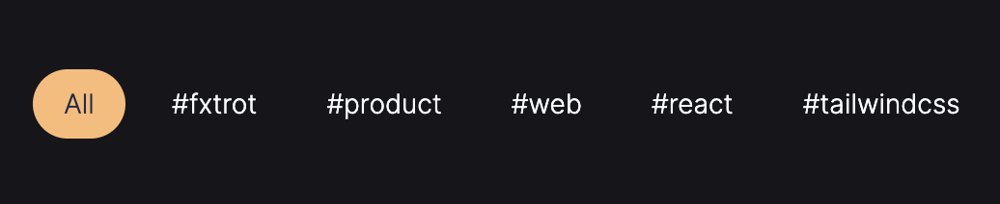
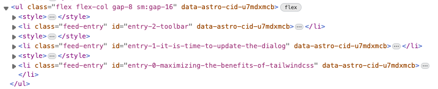
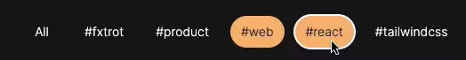

I did something bad and I’m excited to share it.

## Self-inflicted problem (as many are)

I used to ship my personal website to [Vercel](https://vercel.com/), which has a generous free plan. However, I always wanted to use [Cloudflare](https://www.cloudflare.com/), especially if I plan to buy the domain there. They also have quite a good free offering.
As my website is just a bunch of static content, with only few interactive components, I chose [Astro](https://astro.build/). I knew if I need something fancy later on, I can always add it later with Astro. For example, "Share" button is a Preact component (even if it didn’t have to be).

However, sometimes you really want the page to be rendered server side. In my case, /feed page is a list of all articles I published and the list can get quite lengthy (if I actually keep my promise to write more). For the readers to filter the topics they are interested in, I add a list of tags to each post, with all the topics listed on the `/feed` page:



Each filter chip could be a link, adding a query param for filtering, like `?topic=web`. Then, on the server, I would read the param and filter the feed:

```jsx
/* Server only */
const topic = Astro.url.searchParams.get("topic");

// returns ALL articles
const feed = await getFeed();

const filteredFeed = topic
  ? feed.filter((post) => post.data.tags.includes(topic))
  : feed;

// create a flat list of all unique tags used
const topics = [...new Set(feed.flatMap((post) => post.data.tags))];
```

No client JavaScript, and thanks to View Transitions, visitors barely notice that the page was Server Side rendered.

## Bringing solution to the problem that doesn’t exists; get two more problems

As I switched from Vercel to Cloudflare, I immediately noticed the major problem: my images are not optimised. [astro:assets](https://docs.astro.build/en/guides/images/) provide image optimisations using Sharp, and Cloudflare adapter does not support it ([maybe only for now?](https://blog.stackblitz.com/posts/bringing-sharp-to-wasm-and-webcontainers/)).
So, I was left with the choice of:

- manually optimise images every time;
- do not optimise images;
- do not SSR, build the page at build time with all the content, apply filtering client side;

As first two options are not to my liking, I thought what I can do with the last one.

Obviously, I could just remove tags filtering and nobody would notice. But hey, we’re engineers here, and we like the challenge.

First quick solution is to add filtering through JavaScript, we all did that:

- get a list of articles and tags as JSON from the server;
- pass it to a component that keeps track of selected chips and renders a list;
- react to chips selection to filter the list;

This seems like a trivial task for any web framework. With Svelte I could even avoid shipping lots of JavaScript. But hey, we’re engineers here, and we like the challenge.

## Solution

I knew I can just render all articles and then hide those not matching filtering with `display: none`. I also knew I could toggle that with [:has](https://developer.mozilla.org/en-US/docs/Web/CSS/:has) CSS selector. So, I need:

- a list of checkboxes with a `value` corresponding to each tag

```html
<form>
  <input type="checkbox" value="react" />
  <input type="checkbox" value="tailwindcss" />
</form>
```

- hide all articles when one of the checkboxes is checked (filtering applied)

```css
/* if any of the checkboxes is selected, hide all articles */
.feed:has(> form input:checked) .feed-entry {
  display: none;
}
/* TODO: put display: block to those matching selected checkboxes */
```

- Show the articles matching the filter

### Show the articles matching the filter

This last point is the most complex. As the list of tags and articles is dynamic, I couldn’t just list all of them in CSS, but I knew I need something like this:

```css
.feed:has(> form input:where(
  /* list of all article tags */
  [value=react]:checked,
  [value=tailwindcss]:checked
 ) matching-article  { display: block; }
```

I decided to go with a straightforward approach: generate `<style>` tag with each article rendered:

```jsx
/* for each post, take it's slug as id */
const id = `entry-${post.slug}`;
/* form a CSS selector */
const css = /* CSS */ `
.feed:has( > form input:where(
    ${post.data.tags.map((tag) => `[value="${tag}"]:checked`).join(",")})
) #${id} { display: block; }`;

return (
  <>
    <style set:html={css} />
    <li>
      <a href={post.slug}>{post.title}</a>
    </li>
  </>
);
```

Now, each article would include both, the UI and the `<style>` tag which makes it visible when correct checkboxes are selected.



> P.S. Again, any Web framework would solve this better. You would ship less code in general, as instead of repeated HTML for each article, you only ship template for what JS should generate at runtime. Especially for this functionality, the risk of JS being disabled or failed to load can be neglected completely.

### Resetting the state

As the visitors select multiple chips, we want them to be able to reset the selection to see all articles again. The solution is quite simple: [reset input/button](https://developer.mozilla.org/en-US/docs/Web/HTML/Element/input/reset):

```jsx
<form>
  /* style same way as the rest of the chips */
  <input type="reset" />
  <input type="checkbox" value="react" />
</form>
```



### Sprinkles

The CSS shipped with every article could be optimised, to ship less code. As the list is rendered fully at build time, I leverage lightning fast [lightningcss](https://lightningcss.dev/):

```jsx
import { transform } from "lightningcss";

// in each article
const { code } = transform({
  code: Buffer.from(/* CSS */ `
    .feed:has( > form
    input:where(${post.data.tags
      .map((tag) => `[value="${tag}"]:checked`)
      .join(",")}
    )) #${id} { display: block; }
  `),
  minify: true,
});
return (
  <>
    <style set:html={code} />
```

Would also be nice to add view transitions to smoothly animate list items appearing and disappearing. Something like:

```jsx
<form
  onchange="document.startViewTransition()"
  onreset="document.startViewTransition()"
>
```

This doesn’t work, however, as the list items `display` is changed before the snapshot is taken? Not sure.

## Summary

You can play around with the final result on this deployment:

[https://1f1e705a.alvechy.pages.dev/feed](https://1f1e705a.alvechy.pages.dev/feed)

As I said, it was a challenge rather than a final solution. What you should be doing instead?

- ship JavaScript;
- leverage the server. For example, with little bit of JavaScript, you can achieve lazy loading of the feed as user scrolls, instead of shipping huge HTML as is;
- ship more rounded corners;
